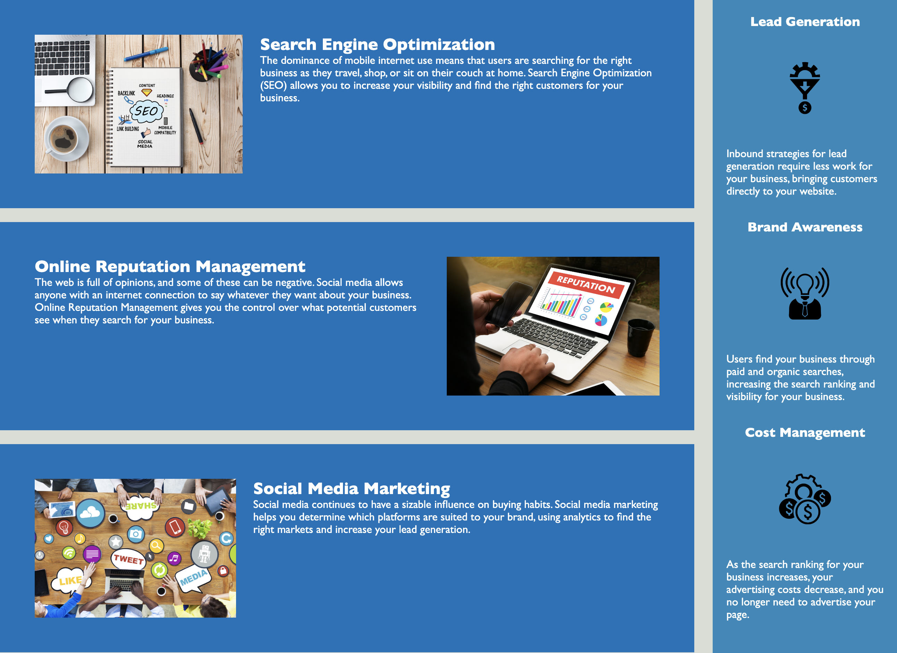

# Module 1

## Description

Changes were made to Horiseon's website to meet accessibility standards and for search engine optimization.  This goal was achieved by using semantic HTML elements and alt tags.

## Installation

N/A

## Usage

Navigate the main page to link to Search Engine Optimization, Online Reputation Management, and Social Media Marketing.

More information about Search Engine Optimization, Online Reputation Management, and Social Media Marketing can be found at the bottom of the page.

## Credits

I came into the bootcamp with some basic HTML and CSS knowledge, thus I have minimal resources.

- css - Adding more than one class html. (2015, July 14). Stack Overflow. Retrieved February 28, 2023, from https://stackoverflow.com/questions/31412923/adding-more-than-one-class-html
- How To Use Header Tags: SEO Best Practices. (2021, December 27). Search Engine Journal. Retrieved February 28, 2023, from https://www.searchenginejournal.com/on-page-seo/header-tags/#close
- Refsnes, H. (n.d.). HTML Semantic Elements. W3Schools. Retrieved February 28, 2023, from https://www.w3schools.com/html/html5_semantic_elements.asp
- What is the difference between section and div tags in HTML ? (2022, November 26). GeeksforGeeks. Retrieved February 28, 2023, from https://www.geeksforgeeks.org/what-is-the-difference-between-section-and-div-tags-in-html/
- How to Add an ALT Attribute to an Image. (2021, May 13). Website Accessibility Testing. Retrieved February 28, 2023, from https://www.accessi.org/blog/how-to-add-an-alt-attribute-to-an-image/
- Mineo, G. (2022, July 27). How to Create a Link to Jump to a Specific Part of a Page [Quick Tip]. HubSpot Blog. Retrieved February 28, 2023, from https://blog.hubspot.com/marketing/jump-link-same-page
- Starter code README.md file, section Mock-Up: followed syntax for placing image in README files.
- Office hours on 01MAR2023 and 02MAR2023: assistance with pushing to Github.

## License

MIT License.

## Deployed Application
https://scelsic2.github.io/horiseon-seo-accessibility/